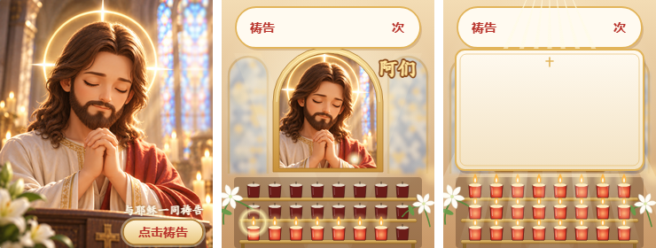

# 祷告时光 pray_c3 · 与耶稣一同祷告

ESP32-C3 SuperMini + 1.50 寸 240×280 SPI 彩屏（GC9306 / GC9307）做的祷告小程序，基于 **ESP-IDF v6.1**。
每按一次板载 BOOT 键，就是一次祷告，点亮一支祈祷蜡烛；祷告次数保存在 Flash 里。



预览图从左到右：开机画面 / 祷告中（光点点亮蜡烛、「阿们」）/ 每满 10 次的经文卡片。

## 玩法

| 画面 | 操作 | 效果 |
|---|---|---|
| 开机画面 | 单击 BOOT | 进入祷告场景 |
| 祷告场景 | 按下 BOOT | 祷告一次，按下即响应 |
| 祷告场景 | 长按 BOOT **1 秒** | 祷告次数清零，并从 Flash 删除，提示「祷告次数已清零」 |

- **开机**：耶稣合掌祷告的画面铺满全屏，光点缓缓上升；右下角是「与耶稣一同祷告 · 点击祷告」按钮。
  按钮放在右下角，是为了不遮挡祷告台上的金色十字架。
- **祷告场景**：
  - 画面：金色拱框里是祷告中的耶稣（从开机图裁出），两侧柔和的彩窗和光束；下方是三层铜烛架，共 24 支红色玻璃祈祷蜡烛。
  - **每次祷告**：一点柔光从下方缓缓升起，飞到烛架上点亮一支蜡烛（火苗慢慢长出，周围泛起一圈光）；右上角升起「阿们」，顶部居中的祷告次数跳一下后加 1。
  - 前 24 次依次点亮整个烛架，之后每次祷告会重新点亮其中一支。
  - 连按时每一下都会计数，最多同时 6 点光在空中。
- **每祷告满 10 次，随机显示一则圣经经文摘句（和合本）**：柔和的光束从上方洒下，一张羊皮纸卡片浮现，
  上面是经文和出处，约 6.5 秒后淡出。共 30 则，见 [`art/verses.txt`](art/verses.txt)。
- 祷告次数停止操作 1 秒后写入 Flash（NVS），断电重启后接着计数。

整体动画刻意保持安静：烛光、柔光、飘浮的光点，没有冲击线、印章之类的热闹效果。

## 关于开机图

原图（`art/logo_orig.png`）背景右上角有一个苦像十字架。画面里是耶稣本人在祷告，身后再挂他被钉十字架的像，
时间和逻辑上不太协调，所以用 [`tools/fix_logo.py`](tools/fix_logo.py) 把那一块换成同一扇彩窗的纹理
（镜像、模糊、羽化融合），得到 `art/logo_src.png`，固件用的是处理后的图。

## 硬件与接线

与 [esp32-c3-muyu](https://github.com/tomdiynew/esp32-c3-muyu) 相同：ESP32-C3 SuperMini（BOOT 键 = GPIO9）+
FPC-1502401（GC9306）或 FPC-1502403（GC9307），开机自动识别。引脚在 [`main/board.h`](main/board.h)。

| 屏 FPC 引脚 | 信号 | ESP32-C3 |
|---|---|---|
| 1 | LCD_RES | GPIO4 |
| 2, 21 | GND | GND |
| 4 | LCD_CS | GPIO10 |
| 5 | LCD_SCL | GPIO6 |
| 7 | LCD_SDA | GPIO7 |
| 24 | LCD_DC | GPIO5 |
| 8, 15, 16 | LCD_3.3V | 3V3 |
| 11, 12 | LED_A | 3V3 经 10Ω |
| 13, 14 | LED_K | GND（或 N-MOSFET，栅极接 GPIO3） |

## 编译和烧录

```powershell
. C:\Espressif\tools\Microsoft.v6.1.PowerShell_profile.ps1
cd <本工程目录>
idf.py set-target esp32c3        # 首次
idf.py build
idf.py -p COMx flash monitor
```

生成好的图片和字库都已入库，直接编译即可。

- 屏幕上的「点击祷告」指按板载 **BOOT 键**（本项目没有接触摸）。
- 烧录不进时：按住 BOOT，点一下 RESET，松开 BOOT，再烧录。
- menuconfig 里 `Prayer → LCD panel` 可手动指定屏型号 / 反色，默认自动识别。
- 重新烧录不会清掉祷告次数（保存在 NVS 分区）；想从 0 开始，长按 BOOT 1 秒，或执行 `idf.py -p COMx erase-flash` 后再烧录。

## 资源占用

| | 大小 |
|---|---|
| 固件 | 约 0.87 MB（程序分区 3.9 MB，剩 78%） |
| 开机图 + 祷告场景背景 | 2 × 134 KB |
| 精灵图（经文卡片、光束、点亮的烛杯、火苗、光点、光圈、「阿们」、按钮等） | 约 330 KB |
| 字库（华文楷体 17 px 经文 207 字、雅黑 13 px 出处 134 字） | 约 30 KB |
| RAM | 静态约 60 KB + 送屏缓冲 2 × 19 KB |

## 美术与文字

- [`tools/fix_logo.py`](tools/fix_logo.py)：去掉原图背景里的苦像十字架（只需运行一次）。
- [`tools/make_art.py`](tools/make_art.py)：开机图缩放；祷告场景背景分三层合成——教堂（彩窗、光束、烛光虚化），
  从开机图裁出的祷告像贴进拱框，前景（金色拱框、烛架与未点亮的红色烛杯、计数面板）；其余精灵用 SVG 画，
  无头 Edge/Chrome 渲染成带 alpha 的精灵图。24 支蜡烛的点亮顺序也在这里定义。
- [`tools/make_text.py`](tools/make_text.py)：经文（和合本，已进入公有领域）与出处，生成 `main/verses.h`
  （文字 + 只含用到的字的字库），同时输出 `art/verses.txt` 方便校对。
- 计数数字的字体（`main/font_ui_data.h`）由 `tools/make_ui_font.py` 生成，与电子木鱼相同。

修改后重新生成（需要 Windows + Python、Pillow，以及 Edge 或 Chrome）：

```powershell
python tools\make_art.py --preview art\preview.png
python tools\make_text.py
idf.py build
```

## 工程结构

```
main/
  main.c        开机 / 祷告两个画面、光点点烛与计数、每 10 次的经文卡片、NVS 保存 / 清零、中文排版
  lcd.c         SPI + GC9306/9307 初始化、自动识别
  button.c      BOOT 键事件
  ui.c          抗锯齿数字
  board.h       引脚
  sprites.h     生成的精灵表、蜡烛位置、布局常量
  verses.h      生成的经文与字库
  art/          生成的图片资源
components/esp_lcd_gc9306/   屏驱动组件
tools/          资源生成脚本
art/            原图 / 处理后的开机图、预览图、经文清单
```
